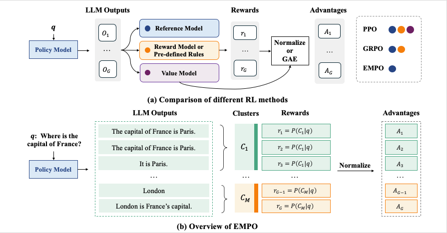

# EMPO: Fully Unsupervised LLM Reasoning Incentivization


<a href="https://huggingface.co/collections/qingyangzhang/empo-67f9f7ad7817ebff4b664010">🤗 HF Models and Datasets Collection </a> |
<a href="https://arxiv.org/abs/2504.05812"> 📑 Arxiv Preprint </a>

For any questions, feel free to open an issue or directly contact to [Qingyang Zhang](qingyangzhang@tju.edu.cn), happy to help and disccuss!

If you find this repo helpful, please consider to **star🌟** this repo for support our work 🙏🙏

## Table of Contents
- [Table of Contents](#table-of-contents)
- [Overview](#overview)
- [News](#news)
- [TRL Quick Start](#trl-quick-start)
- [Verl Quick Start](#verl-quick-start)
- [Evaluation](#evaluation)
- [Acknowledgement](#acknowledgement)
- [Citation](#citation)


## Overview

EMPO (Entropy Minimized Policy Optimization) does not require any supervised information for incentivizing reasoning capabilities (i.e., neither verifiable reasoning traces, problems with golden answers, nor additional pre-trained reward models). By continuously minimizing the predictive entropy of LLMs on unlabeled user queries, EMPO enables self-supervised RL for reasoning capabilities.

<p align="center">

</p>

## News

- [2025-04-08] We introduce EMPO, which makes the first attempt on fully unsupervised LLM reasoning incentivization. Check out our arxiv preprint (first released at 2025.04.08): https://arxiv.org/abs/2504.05812
- [2025-04-30] We release the training and evaluation code for both mathematical reasoning and free-form natural reasoning tasks.
- [2025-06-10] EMPO was accepted by ICML 2025 Test-time Adaption Workshop. See you in Vancouver!

## TRL Quick Start

> Developed upon trl 0.14.0

```
cd trl
pip install -r requirements.txt
sh empo-1.5B-NM-COT-20K.sh
```

## Verl Quick Start
> Developed upon TTRL, with necessary modification to upgrade to the latest verl==0.4.0

```
cd verl
sh examples/ttrl/empo-math.sh
```


## Evaluation:
> The evaluation scripts from the [Online-DPO-R1](https://github.com/RLHFlow/Online-DPO-R1), please refer to the original codebase for more details.

For mathematical tasks:
```
cd eval_math
sh test.sh
```

As suggested by [Spurious Rewards](https://rethink-rlvr.notion.site/Spurious-Rewards-Rethinking-Training-Signals-in-RLVR-1f4df34dac1880948858f95aeb88872f) and [Incorrect Baseline](https://safe-lip-9a8.notion.site/Incorrect-Baseline-Evaluations-Call-into-Question-Recent-LLM-RL-Claims-2012f1fbf0ee8094ab8ded1953c15a37#2022f1fbf0ee80cb9b18f7eac460410a), we adpot the same test prompt to both pre-RL Qwen Base models and RL-trained models. Besdies, we add Random+Format Reward Baseline for more comprehensive comparison. You can also modify the code [here](https://github.com/QingyangZhang/EMPO/blob/main/eval_math/utils.py#L140) to investigate the influence of different test prompt.

| Model                          | Supervision    | MATH | Minerva Math | Olympiad Bench | AIME24 | AMC23 | Avg. |
|--------------------------------|----------------|------|--------------|----------------|--------|-------|------|
| **1.5B model**                 |                |      |              |                |        |       |      |
| Qwen2.5-Math                   | None           | 52.2 | 10.7         | 25.2           | 10.0   | 42.5  | 28.1 |
| Qwen2.5-Math-Instruct          | $\{q, r, a\}$  | 73.8 | 30.9         | 38.7           | 6.7    | 52.5  | 40.5 |
| Qwen2.5-Math w/SFT             | $\{q, r, a\}$  | 61.8 | 26.1         | 27.1           | 3.3    | 37.5  | 31.2 |
| Qwen2.5-Math w/Rand Format     | $\{q, a\}$     | 65.0 | 26.1         | 30.7           | 10.0   | 55.0  | 37.4 |
| Qwen2.5-Math w/GRPO            | $\{q, a\}$     | 75.2 | 32.0         | 33.6           | 16.7   | 52.5  | 42.0 |
| Qwen2.5-Math w/EMPO            | $\{q\}$        | 73.0 | 32.4         | 36.6           | 13.3   | 55.0  | 42.1 |
| **7B model**                   |                |      |              |                |        |       |      |
| Qwen2.5-Math                   | None           | 64.8 | 15.1         | 26.7           | 6.7    | 40.0  | 30.7 |
| Qwen2.5-Math Instruct          | $\{q, r, a\}$  | 82.8 | 43.8         | 41.2           | 16.7   | 62.5  | 49.4 |
| Qwen2.5-Math w/SFT             | $\{q, r, a\}$  | 72.2 | 34.6         | 33.2           | 10.0   | 45.0  | 39.0 |
| Qwen2.5-Math w/Rand Format     | $\{q, a\}$     | 73.0 | 26.5         | 37.0           | 26.7   | 52.5  | 43.1 |
| Qwen2.5-Math w/ODPO            | $\{q, a\}$     | 76.8 | 30.9         | 37.9           | 26.7   | 62.5  | 47.0 |
| Qwen2.5-Math w/GRPO            | $\{q, a\}$     | 77.8 | 39.7         | 39.1           | 20.0   | 57.5  | 46.8 |
| Qwen2.5-Math w/EMPO            | $\{q\}$        | 78.0 | 40.4         | 37.3           | 20.0   | 65.0  | 48.1 |

## Acknowledgement

This repo is built upon [Semantic Entropy](https://github.com/jlko/semantic_uncertainty), [Open-R1](https://github.com/huggingface/open-r1), [Online-DPO-R1](https://github.com/RLHFlow/Online-DPO-R1), and [TTRL](https://github.com/PRIME-RL/TTRL). We thank all these researchers for generously sharing their insights, model weights, data, and codes.

## Related Works

There are many awesome works related to this paper that you may also interested with:

- LLM Uncertainty Quantification: [Semantic Entropy (ICLR'23, Nature'24)](https://openreview.net/pdf?id=VD-AYtP0dve)
- Test-time Adaption in Computer Vision: [COME (ICLR'25)](https://openreview.net/pdf?id=506BjJ1ziZ)
- Presudo Feedback for LLM Reasoning: [PFPO (ICLR'25 spotlight)](https://arxiv.org/abs/2411.16345)
- Test-time Reinforcement Learning: [TTRL (cocurrent work)](https://arxiv.org/abs/2504.16084)

More papers are listed in [Awesome Reinforcement Learning with Internal Reward Paper list](https://github.com/QingyangZhang/Label-Free-RLVR).

## Citation

If you find this work helpful, please consider to **star🌟** this repo. Thanks for your support!
```
@article{zhang2025right,
  title={Right Question is Already Half the Answer: Fully Unsupervised LLM Reasoning Incentivization},
  author={Zhang, Qingyang and Wu, Haitao and Zhang, Changqing and Zhao, Peilin and Bian, Yatao},
  journal={arXiv preprint arXiv:2504.05812},
  year={2025}
}
```
